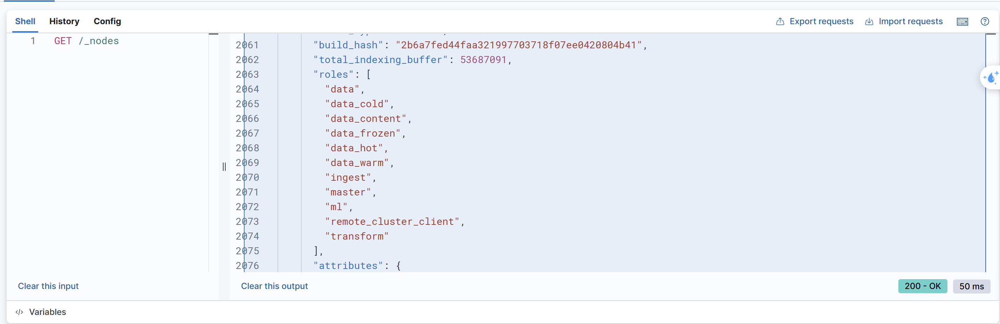

# ELASTICSEARCH


The status is yellow because Elasticsearch warns us that we are running a single node cluster.
If this node goes down, there is no way to handle requests like search request etc.

## Inverted index

Elasticsearch uses Apache Lucene behind the scenes. In fact, Lucene is the one that handles the storage, indexing
documents, search and retrieving the documents, etc. Apache Lucene is a Java library, it's not a server. It's designed
to be added as a dependency.

Elasticsearch is a distributed REST server on top of Apache Lucene.

The actual core for the search engine is Lucene, but making it highly available, horizontally scalable and making it as
a proper search engine with the appropriate APIs for any application to use it. That's what Elasticsearch does.

When we add a document to the index, Elasticsearch will handle it over to Lucene. Lucene will take the document, and it
will parse the document means it will tokenize the value.


It does not modify the document, but it will extract the information as tokens.
With these tokens, it will be maintaining one table called inverted index.

* Inverted Index

| Term    | Document IDs | Positions |
|---------|--------------|-----------|
| Apple   | 1,3          | [0],[0]   |
| iPhone  | 1            | [1]       |
| 14      | 1            | [2]       |
| Samsung | 2            | [0]       |
| Galaxy  | 2            | [1]       |
| S21     | 2            | [2]       |
| MacBook | 3            | [1]       |
| Pro     | 3            | [2]       |

When we search "Apple", it will return all the documents that have "Apple" in it based on the inverted index,
particularly the document IDs.

In RDBMS, it will have to scan the entire table.

### Search (Simplified)

* Elasticsearch:
    * Similar to Java HashMap → O(1)
* RDBMS:
    * Similar to the List contains method → O(n)

When search "Apple Iphone", the Elasticsearch will tokenize the input strike like this:

* ["Apple", "Iphone"]

We will not only be tokenizing the document when we store, but also we will be tokenizing this input.

In the real world, we might be having multiple fields like name, description, etc. In that case for every field we will
be having one inverted index like this:

```json
[
  {
    "name": "Apple Iphone",
    "description": "phone with stuff"
  },
  {
    "name": "Samsung Galaxy",
    "description": "sleek phone with stuff"
  }
]
```

we have one inverted index for name:

| Term    | Document IDs | Positions |
|---------|--------------|-----------|
| Apple   | 1,3          | [0],[0]   |
| iPhone  | 1            | [1]       |
| 14      | 1            | [2]       |
| Samsung | 2            | [0]       |
| Galaxy  | 2            | [1]       |
| S21     | 2            | [2]       |
| MacBook | 3            | [1]       |
| Pro     | 3            | [2]       |

we have one inverted index for description:

| Term  | Document IDs | Positions |
|-------|--------------|-----------|
| phone | 1, 2         | [0],[1]   |
| stuff | 1, 2         | [2],[3]   |
| sleek | 2            | [0]       |

* Tokenization is just one part of the analysis process.

### Term Dictionary, term frequency, Document frequency


### Segment

* Fundamental unit of storage and indexing

* When we store some documents into our product index. Behind the scenes, it's split into multiple segments. Each
  segment is a self-contained, immutable index.


* The Product index has three segments:
    * products-0
    * products-1
    * products-2

Each of every segment will act like a mini index. They will be having their own inverted index.

#### Adding Documents

* New documents would be in the memory buffer.
* Periodically (time/memory), it is flushed to disk as a new Segment!
* We will have multiple segments.
    * Props: Superfast writes.
    * Cons: Search might be slow as we have to search across multiple segments to retrieve the results.

#### Segments Merge

* Smaller Segments are periodically merged into Larger Segments
    * Larger Segments help with search
    * Efficient Parallel search across segments.

#### Immutable Segment!

* Deletion is NOT immediately reflected in the segment. Instead, there will be a marker.
* When we delete a document, it will be adding one entry saying that the product ID is deleted.
* When a request comes in, the segment which has been marked will also return the result with the product ID deleted.
* However, there will be a deletion marker saying that this document is deleted.
* So because of that, the Lucene will remove that, or it will not include the result returned by this segment.
* Later as part of the merge process, it will be removed completely.

* Update => Delete + Insert.

## Refresh API

```cmd
POST /{index}/_refresh
```

Any new documents inserted or updated will not reflect immediately during search, or it will not be immediately
available for search. By default, Elasticsearch refreshes after every 1 second, so we can search new documents.

When we insert a bunch of documents one by one, Es will try to index documents in bulk.
We have to use refresh API to get documents in Spring Boot. Because the program will be executed very fast more than one
second.

## Clustering, Sharding & Replication

### Clustering


Es instances (nodes) communicate with each other using port 9300 for cluster coordination, replication, and other
internal operations.

### Sharding


Sharing for scaling purpose is done by Elasticsearch.

Shard to segments done by Lucene for faster read and write.

#### Routing

```text
share = hash(routing_key) % number_of_shards

//routing_key is _id
```

#### Replication


* A primary share and the corresponding replica share will not be stored on the same instance!
* Replica shares are exact copy of primary shards.
    * They do not do the "indexing" process. They just get the indexed data from primary share.
    * Once promoted to primary share, then it will do the indexing process when documents are stored.
* Replica shards can serve search requests (imagine AWS/GCP read replicas)
    * It can increase search requests throughput.

### Primary/Replica Shards

* A primary share and the corresponding replica shards will NOT be stored on the same instance!.
    * Replica shards -> Availability.
* Multiple primary shards of the same index could be placed on the same instance!
    * Primary shards → Scaling (data scaling & throughput scaling)
        * Indexing in parallel and to improve the performance of indexing

### Node Roles

Cluster operation is a lot of work. Each node in the cluster can be assigned to perform specific roles.
They can perform one specific role or more than one role depending on the configuration.

By default, when you set up a cluster. One node from this group will be elected as the master.
This master manages the cluster.

It's responsible for creating any index, and this will decide which node can keep the primary shards,
which node will keep the replica shards, etc. All other nodes will just listen to what the master says.

### Voting only

When the master dies, for some reason, some other node form the cluster will be elected as the new master, and it will
continue like that.

Some nodes in the cluster can be configured in such a way that they don't want to become master. But they can

### Data role node

The data role will store the data, handle the indexing and search operations.
If a node is going to play the data role, then that node might need more disk space and memory.

### Coordinating Node

We will send the request to these nodes. They route requests, distribute queries, and merge responses from shards.
We can have a dedicated coordinating nodes in a large cluster.

### Ingest Node

Processes and transforms data before indexing (using ingest pipelines).

Useful for data enrichment tasks. Add user location based on IP.

## Elasticsearch cluster

```yaml
services:
  es01:
    image: docker.elastic.co/elasticsearch/elasticsearch:8.17.0
    environment:
      - node.name=es01
      - cluster.name=my-cluster
      - xpack.security.enabled=false
      - xpack.security.http.ssl.enabled=false
      - cluster.initial_master_nodes=es01,es02,es03 # Used only for initial cluster formation. One of these nodes will be elected as the first master.
      - discovery.seed_hosts=es02,es03 # This node will contact these nodes to get cluster information when joining the cluster.
      - "ES_JAVA_OPTS=-Xms512m -Xmx512m"
    ports:
      - 9201:9200
  es02:
    image: docker.elastic.co/elasticsearch/elasticsearch:8.17.0
    environment:
      - node.name=es02
      - cluster.name=my-cluster
      - xpack.security.enabled=false
      - xpack.security.http.ssl.enabled=false
      - cluster.initial_master_nodes=es01,es02,es03
      - discovery.seed_hosts=es01,es03
      - "ES_JAVA_OPTS=-Xms512m -Xmx512m"
    ports:
      - 9202:9200
  es03:
    image: docker.elastic.co/elasticsearch/elasticsearch:8.17.0
    environment:
      - node.name=es03
      - cluster.name=my-cluster
      - xpack.security.enabled=false
      - xpack.security.http.ssl.enabled=false
      - cluster.initial_master_nodes=es01,es02,es03
      - discovery.seed_hosts=es01,es02
      - "ES_JAVA_OPTS=-Xms512m -Xmx512m"
    ports:
      - 9203:9200
  kibana:
    image: docker.elastic.co/kibana/kibana:8.17.0
    ports:
      - 5601:5601
    environment:
      - ELASTICSEARCH_HOSTS=["http://es01:9200","http://es02:9200","http://es03:9200"]
```

### Initial Master Demo

```yaml
services:
  es01:
    image: docker.elastic.co/elasticsearch/elasticsearch:8.17.0
    environment:
      - node.name=es01
      - cluster.name=my-cluster
      - xpack.security.enabled=false
      - xpack.security.http.ssl.enabled=false
      - cluster.initial_master_nodes=es01
      - "ES_JAVA_OPTS=-Xms512m -Xmx512m"
  es02:
    image: docker.elastic.co/elasticsearch/elasticsearch:8.17.0
    environment:
      - node.name=es02
      - cluster.name=my-cluster
      - xpack.security.enabled=false
      - xpack.security.http.ssl.enabled=false
      - cluster.initial_master_nodes=es01
      - discovery.seed_hosts=es01
      - "ES_JAVA_OPTS=-Xms512m -Xmx512m"
  es03:
    image: docker.elastic.co/elasticsearch/elasticsearch:8.17.0
    environment:
      - node.name=es03
      - cluster.name=my-cluster
      - xpack.security.enabled=false
      - xpack.security.http.ssl.enabled=false
      - cluster.initial_master_nodes=es01
      - discovery.seed_hosts=es01
      - "ES_JAVA_OPTS=-Xms512m -Xmx512m"
  kibana:
    image: docker.elastic.co/kibana/kibana:8.17.0
    ports:
      - 5601:5601
    environment:
      - ELASTICSEARCH_HOSTS=["http://es01:9200","http://es02:9200","http://es03:9200"]
```

With these configurations, although we don't define seed_hosts from es2 to es3 - vice vesa.
But when we bring the es1 down, the es2 can know the es3 - vice versa. Even though in our configuration, we did not
specify about the es2 to es3. They still are able to figure it out.

Remember, the initial master node just apply when you start the new cluster. It does not mean that es01 will be the
master lifelong.
It does not mean that es02 or es03 can't become the master.
Anyone else can become the master when the initial master dies.

To see every node, what are the roles assigned. Use this command

```cmd
GET /_nodes
```



It means the es01, es02, es03 can be master, data node,

### Coordination Only Role

By default, each node in the cluster will be playing the coordination role.
Even if you set the data role to the node, it will also be doing the coordination.
If you want to make a node only play the coordination role, then you need to set `node.roles:[]` 