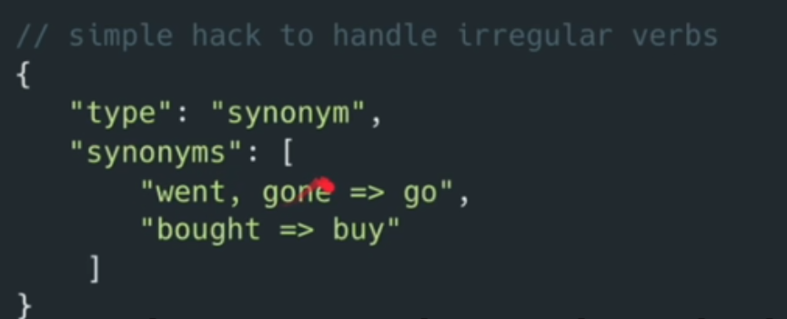

Reference : https://www.elastic.co/guide/en/elasticsearch/reference/current/analysis-tokenfilters.html

```cmd
# there is also uppercase token filter
POST /_analyze
{
  "text": "This is a sample text to see how tokens are generated.",
  "tokenizer": "standard",
  "filter": [
    "lowercase"
    ]
}

POST /_analyze
{
  "text": "Reach out to <b>Support</b> at support@domain.com or send email to 123, Non Main Street, Atlanta, for assistance!",
  "char_filter": [
      {
        "type": "html_strip"
      }
    ],
    "tokenizer": "standard",
    "filter": [
      "lowercase"
      ]
}


# remove tokens based on length
POST /_analyze
{
  "text": "Reach out to <b>Support</b> at support@domain.com or send email to 123, Non Main Street, Atlanta, for assistance!",
  "char_filter": [
    {
      "type": "html_strip"
    }],
    "tokenizer": "standard",
    "filter": [
      {
        "type": "length",
        "min": 3,
        "max": 5
      }
      ]
}

# unique tokens (to)
POST /_analyze
{
  "text": "Reach out to <b>Support</b> at support@domain.com or send email to 123, Non Main Street, Atlanta, for assistance!",
  "tokenizer": "standard",
  "filter": [
    "unique"
    ]
}
```

# Synonym filter

```cmd
POST /_analyze
{
  "text": "10 Stylish Couch Ideas to Transform Your Living room",
  "tokenizer": "standard",
  "filter": [
    "lowercase",
    {
      "type": "synonym",
      "synonyms": [
        "couch, sofa",
        "mug, cup, tumbler"
        ]
    }
    ]
}

# synonym filter for a common term
# convert Amazon Web Services => aws, amazon cloud => aws
POST /_analyze
{
  "text": "Amazon Web Services offfers cloud cputting solutions. AWS is also called amazon cloud",
  "tokenizer": "standard",
   "filter": [
     "lowercase",
     {
       "type": "synonym",
       "synonyms": [
         "amazon web services, amazon cloud => aws"]
     }
     ]
}
```

# stop words

a, an, and, are, as, at, be, but, by, for, if, in, into, is, it, no, not, of, on, or, such, that, the, their, then,
there, these, they, this, to, was, will, with

```cmd
POST /_analyze
{
  "text": "Reach out to Support at support@domain.com or send email to 123, Non Main Street, Atlanta, for assistance!",
  "tokenizer": "standard",
  "filter": [
    "stop"
    ]
}
```

# Stemming

Text processing technique used to reduce words to their root or base form. For example, the word "running" can be
reduced to "run".

Stemming is language-dependent but often involves removing the prefixes and suffixes of words.

For example:

- Cooking with Confidence - Tips for Beginners
- Cooked with Love - Recipes for Beginners

"Cooking" and "Cooked" will be reduced to "cook". The "cook" will be stored as part of the inverted index.

By default, Elasticsearch uses the Porter stemming algorithm to find the root form of a
word. https://snowballstem.org/algorithms/porter/stemmer.html

Reference: https://www.elastic.co/guide/en/elasticsearch/reference/current/analysis-stemmer-tokenfilter.html

Some works can't be stemmed using the Porter stemming algorithm. For example, "went" can't be reduced to "go". Because
it's not based on a dictionary. It's just a rule.

We can use synonym filter to solve this problem.


```cmd
POST /_analyze
{
  "text": "I cooked dished while sitting comfortably and listening to music in the kitchen.",
  "tokenizer": "standard",
  "filter": [
    "lowercase",
    "stemmer"
    ]
}

POST /_analyze
{
  "text": "ponies",
  "tokenizer": "standard",
  "filter": [
    {
      "type": "stemmer",
      "language": "english"
    }
    ]
}
```