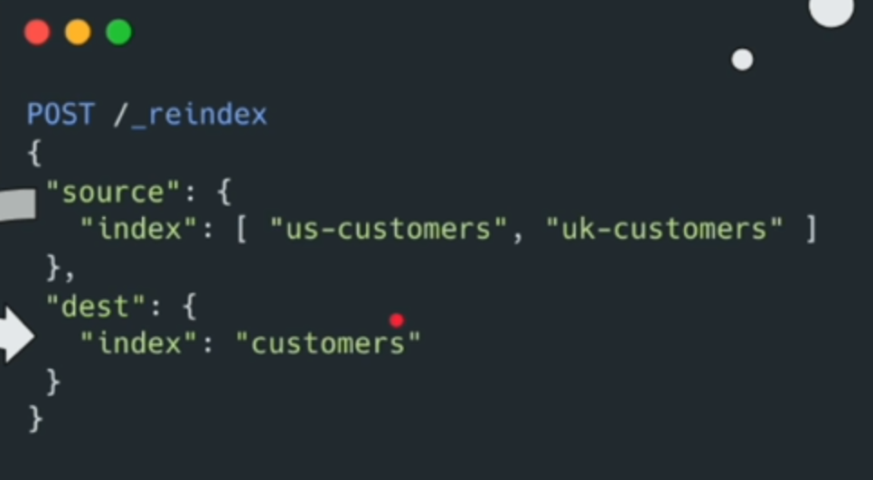
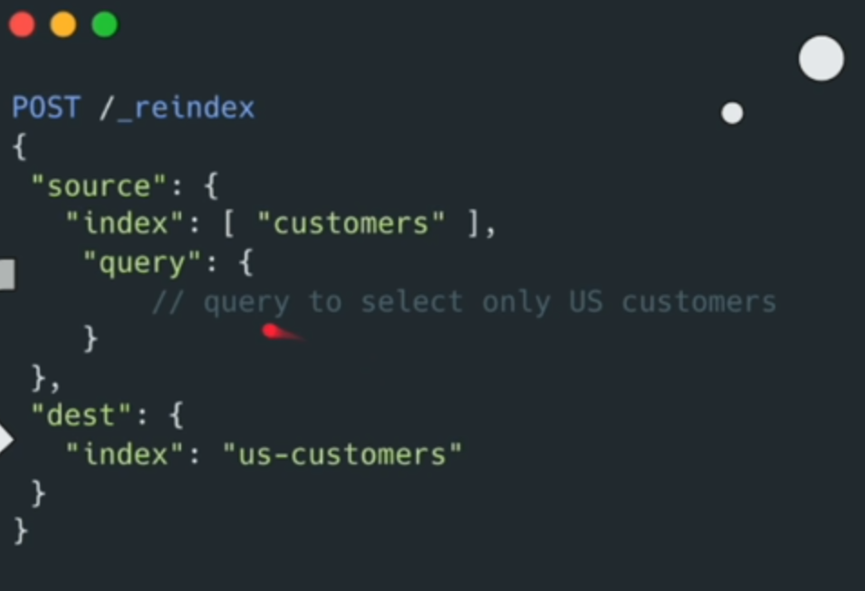

```cmd
PUT /old-index
{
  "settings": {
    "number_of_shards": 1,
    "number_of_replicas": 0
  }
}


POST /old-index/_bulk
{ "create" : {} }
{ "name" : "item1"}
{ "create" : {} }
{ "name" : "item2"}
{ "create" : {} }
{ "name" : "item3"}
{ "create" : {} }
{ "name" : "item4"}
{ "create" : {} }
{ "name" : "item5"}
{ "create" : {} }
{ "name" : "item6"}


# query all
GET /old-index/_search

# get shards info
GET /_cat/shards/old-index?v

# create new index with 2 shards
PUT /new-index
{
  "settings": {
    "number_of_shards": 2,
    "number_of_replicas": 1
  }
}

# reindex
POST /_reindex
{
  "source": {
    "index": "old-index"
  },
  "dest": {
    "index": "new-index"
  }
}


GET /new-index/_search

GET /_cat/shards/new-index?v

PUT /new-index/_settings
{
  "index": {
    "refresh_interval": "1s"
  }
}

DELETE /old-index,new-index
```


Reindex with specific fields
```cmd
PUT /old-index
{
  "settings": {
    "number_of_shards": 1,
    "number_of_replicas": 0
  }
}


# bulk insert
POST /old-index/_bulk
{ "create" : {} }
{ "name": "Alice Johnson", "age": 28, "gender": "Female", "city": "NY" }
{ "create": {} }
{ "name": "Michael Smith", "age": 34, "gender": "Male", "city": "LA" }
{ "create": {} }
{ "name": "Bao ND", "age": 25, "gender": "Male", "city": "VN" }

GET /old-index/_search


GET /_cat/shards/old-index?v


PUT /new-index
{
  "settings": {
    "number_of_shards": 2,
    "number_of_replicas": 1
  }
}

# reindex with specific fields
POST /_reindex
{
  "source": {
    "index" : "old-index",
    "_source": ["name", "city"]
  },
  "dest": {
    "index": "new-index"
  }
}


GET /new-index/_search

GET /_cat/shards/new-index?v

PUT /new-index/_settings
{
  "index":{
    "refresh_interval": "1s"
  }
}


DELETE /old-index,new-index
```


We can also reindex from multiple index to a single index


We can select specific documents if you want from an index for example
