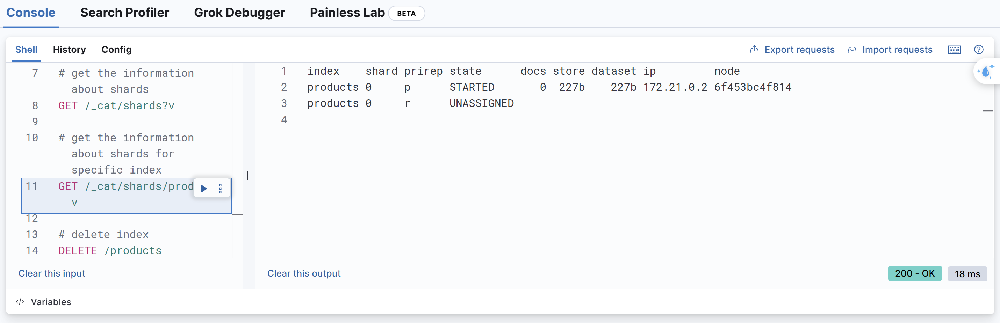

# Index Default Setting

```cmd
# create an index
PUT /products

# status could be yellow
GET /_cluster/health

# get the information about shards, it will have all the shards
GET /_cat/shards?v

# get the information about shards for specific index
GET /_cat/shards/products?v

# delete index
DELETE /products
```


p stands for the primary shard.
r stands for the replica shard.

When we create the product index. By default, it creates the index with one primary share and one replica shard.
The primary shard is running as part of the Docker container.
But with the replica share, it doesn't know where to run it.
Because we just have a single node cluster.
That's the reason why the status is yellow.

We can override this default when creating the index.

```cmd
PUT /products
{
    "settings": {
        "number_of_shards": 1,
        "number_of_replicas": 0
    }
}
```

The status is now green. Because we only have one primary shard and no replicas.

To override