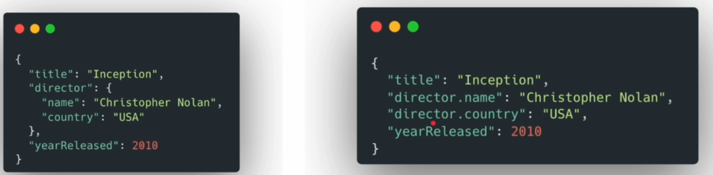

```json
{
  "title": "Inception",
  "director": {
    "name": "Christopher Nolan",
    "country": "USA"
  },
  "yearReleased": 2010
}
```

We can use two ways to bulk insert data and mapping.



```cmd
DELETE /movies

PUT /movies
{
  "mappings" :{
    "properties": {
      "title": {
        "type": "text"
      },
      "yearReleased": {
        "type": "integer"
      },
      "director":{
        "properties": {
          "name": {
            "type": "text"
          },
          "country": {
            "type":  "keyword"
          }
        }
      }
    }
  }
}

GET /movies/_mapping


POST /movies/_bulk
{ "create": {} }
{ "title": "Inception", "director": { "name": "BaoND Nguyen", "country": "VN"}, "yearReleased": 2010}
{ "create": {} }
{ "title": "Parasite", "director": { "name": "Thomas Nguyen", "country": "USA"}, "yearReleased": 2019}
{ "create": {} }
{ "title": "The Godfather", "director": { "name": "Francis Ford Coppola", "country": "Korea"}, "yearReleased": 1988}


GET /movies/_search?q=nguyen


DELETE /movies

PUT /movies
{
  "mappings": {
    "properties": {
      "title":{
        "type": "text"
      },
      "yearReleased": {
        "type": "integer"
      },
      "director.name":{
        "type": "text"
      },
      "director.country":{
        "type": "keyword"
      }
    }
  }
}


POST /movies/_bulk
{ "create": {} }
{ "title": "Inception", "director.name": "BaoND Nguyen", "director.country": "VN", "yearReleased": 2010}
{ "create": {} }
{ "title": "Parasite", "director.name":  "Thomas Nguyen", "director.country": "USA", "yearReleased": 2019}
{ "create": {} }
{ "title": "The Godfather",  "director.name":   "Francis Ford Coppola", "director.country": "Korea", "yearReleased": 1988}


GET /movies/_search?q=nguyen

```


