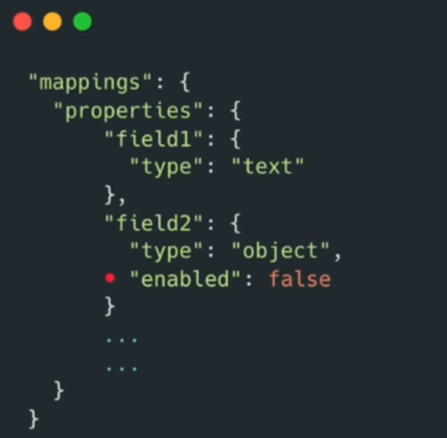

We have to say type: object because we really do not care about this field.

```cmd
DELETE /blogs


PUT /blogs
{
  "mappings":{
    "properties": {
      "title": {
        "type": "text"
      },
      "body": {
        "type": "object",
        "enabled": false
      }
    }
  }
}


POST /blogs/_bulk
{ "create": { } }
{ "title": "My Hobbies", "body": "I enjoy <em>reading</em> books and <em>traveling</em> around the world." }
{ "create": {  } }
{ "title": "Career Goals", "body": "I aspire to become a <u>Data Scientist</u> and work with <b>big data</b> technologies." }
{ "create": {  } }
{ "title": "Stemmer Example", "body": "I cooked dishes while sitting comfortably and listening to music in the kitchen." }
{ "create": { } }
{ "title": "Life with Ponies", "body": "I enjoy caring for my ponies and exploring the countryside with them." }


GET /blogs/_search?q=em
GET /blogs/_search?q=u
GET /blogs/_search?q=around
GET /blogs/_search?q=cook
GET /blogs/_search?q=cooked
GET /blogs/_search?q=pony
GET /blogs/_search?q=ponies

# the body will still be in the source. But only thing í it will not be indexed
GET /blogs/_search?q=hobbies
GET /blogs/_search?q=stemmer


GET /blogs/_mapping


```