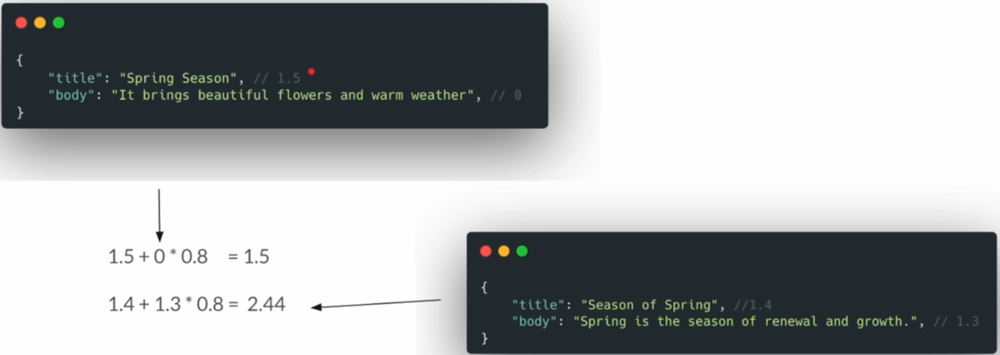

Multi match will try to find the score for each and every field.

With multi match - best_fields  + tie_breaker
By default tie_beaker = 0 and best_fields is enabled.

The highest score of a fields + tie_breaker * another score of field

With tie_breaker = 0.8




As long as tie_breaker is 1, it's called most_fields
```cmd
DELETE /articles

PUT /articles
{
  "mappings": {
    "properties": {
      "title" : {"type": "text"},
      "body" : {"type": "text"}
    }
  }
}


POST /articles/_bulk
{ "create": {} }
{ "title": "The Rainy Season", "body": "The rainy season can be a blessing or a curse."}
{ "create": {} }
{ "title": "The Winter season", "body": "The winter season is often harsh and cold."}
{ "create": {} }
{ "title": "Summer Season", "body": "Summer season brings hot and humid weather."}
{ "create": {} }
{ "title": "The Spring Breeze", "body": "The spring breeze is gentle and refreshing."}
{ "create": {} }
{ "title": "Season of Spring", "body": "Spring is the season of renewal and growth."}
{ "create": {} }
{ "title": "Spring Season", "body": "It brings beautiful flowers and warm weather."}
{ "create": {} }
{ "title": "About Me", "body": "I love spending time outdoors during the spring season."}
{ "create": {} }
{ "title": "My favorite season", "body": "Spring is my favorite season of the year."}
{ "create": {} }
{ "title": "Boot Missing", "body": "I lost my favorite hiking boot in the mud during spring" }
{ "create": {} }
{ "title": "Introduction To Spring Framework", "body": "The app was developed using spring boot framework" }
{ "create": {} }
{ "title": "The Bike Rider", "body": "He kicked off his boot and relaxed by the fire." }


# OR operator
POST /articles/_search
{
  "query":{
    "multi_match": {
      "query": "spring season",
      "fields": ["body"]
    }
  }
}

# AND operator
POST /articles/_search
{
  "query": {
    "multi_match": {
      "query": "spring season",
      "fields": ["body"],
      "operator": "and"
    }
  }
}


POST /articles/_search
{
  "query": {
    "multi_match": {
      "query": "spring season",
      "fields": ["title", "body"],
      "operator": "and"
    }
  }
}

# we can give more weight to title
POST /articles/_search
{
  "query": {
    "multi_match": {
      "query": "spring season",
      "fields": ["title^3", "body"],
      "operator": "and"
    }
  }
}

# types - best fields
# "type": "best_fields" default - check the score
# "tie_breaker": 0 //default
POST /articles/_search
{
  "query": {
    "multi_match": {
      "query": "spring season",
      "fields": ["title", "body"],
      "operator": "and",
      "type": "best_fields",
      "tie_breaker": 0 //default
    }
  }
}

POST /articles/_search


POST /articles/_search
{
  "query": {
    "multi_match": {
      "query": "spring season",
      "fields": ["body", "title"],
      "operator": "and",
      "type": "most_fields"
    }
  }
}

# fuzziness
POST /articles/_search
{
  "query":{
    "multi_match": {
      "query": "seasen",
      "fields": ["title", "body"],
      "operator": "and",
      "fuzziness": 1
    }
  }
}


# phrase  - slop
POST /articles/_search
{
  "query": {
    "multi_match": {
      "query": "spring season",
      "fields": ["title", "body"],
      "type": "phrase",
      "slop": 1
    }
  }
}

```