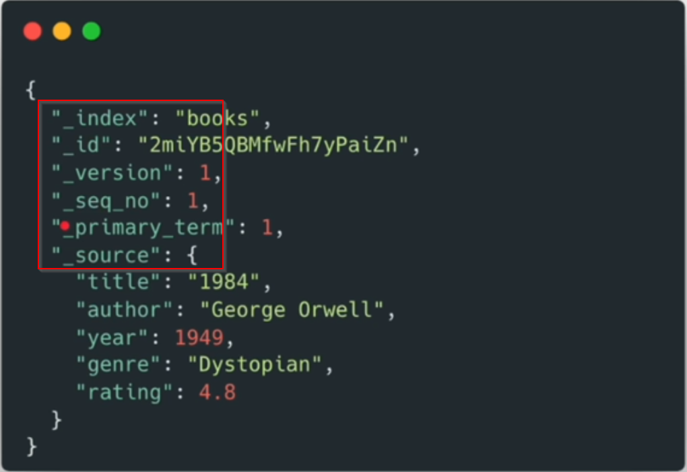
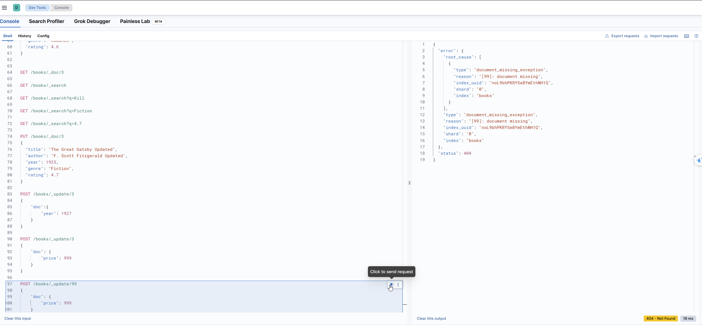

## CRUD

### Create

* Create index

```cmd
PUT /books
```

### Insert

* Insert Documents

```cmd
POST /books/_doc
{
    "title": "The Lord of the Rings",
    "author": "J. R. R. Tolkien",
    "year": 1954,
    "genre": "Fantasy",
    "rating": 9.0
}

POST /books/_doc
{
    "title": "The Hobbit",
    "author": "J. R. R. Tolkien",
    "year": 1937,
    "genre": "Fiction",
    "rating": 8.5
}
```



These additional fields will have the underscore prefix. These are called metadata fields.

_Version, _seq_no,_ primary_term. These are all related to optimistically lock concurrency control to prevent conflicts
when multiple requests update the same document at the same time.

* Insert documents with our own ID

```cmd
POST /books/_doc/1
{
  "title": "To Kill a Mockingbird",
  "author": "Harper Lee",
  "year": 1960,
  "genre": "Fiction",
  "rating": 4.9
}

POST /books/_doc/2
{
  "title": "1984",
  "author": "George Orwell",
  "year": 1949,
  "genre": "Dystopian",
  "rating": 4.8
}

POST /books/_doc/3
{
  "title": "The Great Gatsby",
  "author": "F. Scott Fitzgerald",
  "year": 1925,
  "genre": "Fiction",
  "rating": 4.7
}

POST /books/_doc/4
{
  "title": "Pride and Prejudice",
  "author": "Jane Austen",
  "year": 1813,
  "genre": "Romance",
  "rating": 4.6
}

```

### Read

* To get the doc with ID

```cmd
GET /books/_doc/1
```

* To get all docs

```cmd
GET /books/_search
```

* The example response:

    - took: the milliseconds it took to execute the request

```json
{
  "took": 12,
  "timed_out": false,
  "_shards": {
    "total": 1,
    "successful": 1,
    "skipped": 0,
    "failed": 0
  },
  "hits": {
    "total": {
      "value": 4,
      "relation": "eq"
    },
    "max_score": 1,
    "hits": [
      {
        "_index": "books",
        "_id": "1",
        "_score": 1,
        "_source": {
          "title": "To Kill a Mockingbird",
          "author": "Harper Lee",
          "year": 1960,
          "genre": "Fiction",
          "rating": 4.9
        }
      },
      {
        "_index": "books",
        "_id": "2",
        "_score": 1,
        "_source": {
          "title": "1984",
          "author": "George Orwell",
          "year": 1949,
          "genre": "Dystopian",
          "rating": 4.8
        }
      },
      {
        "_index": "books",
        "_id": "3",
        "_score": 1,
        "_source": {
          "title": "The Great Gatsby",
          "author": "F. Scott Fitzgerald",
          "year": 1925,
          "genre": "Fiction",
          "rating": 4.7
        }
      },
      {
        "_index": "books",
        "_id": "4",
        "_score": 1,
        "_source": {
          "title": "Pride and Prejudice",
          "author": "Jane Austen",
          "year": 1813,
          "genre": "Romance",
          "rating": 4.6
        }
      }
    ]
  }
}
```

# Search for documents containing keyword

```cmd
GET /books/_search?q=Lee

GET /books/_search?q=Fiction
```

### Update an entire document, POST and PUT will work

* To update a doc with ID.
    * POST will also work. PUT/POST will have the upsert behavior.
    * Upsert: If the document does not exist, it will be created. If the document exists, it will be updated.

```cmd
PUT /books/_doc/3
{
  "title": "The Great Gatsby Updated",
  "author": "F. Scott Fitzgerald Updated",
  "year": 1925,
  "genre": "Fiction",
  "rating": 4.7
}
```

This request will remove the existing document and replace a new one.

* Note: Basically you have replaced the whole object instead just updated the fields. Because, the Elasticsearch will
  automatically remove the fields that are not present in the request.

### To update only year, only POST will work, PUT will not work

```cmd
POST /books/_update/3
{
  "doc": {
    "year": 1926
  }
}
```

* TO add a new field. When we update a document, we some fields that are not present in the document, Elasticsearch will
  create them

```cmd
POST /books/_update/3
{
  "doc": {
    "price": 999
  }
}
```

* If we try to update for a missing bookId. It will fail
  

But we can use the upsert behavior for the update request
By default, doc_as_upsert is false.

```cmd
POST /books/_update/15
{
  "doc": {
    "price": 999
  },
  "doc_as_upsert": true
}
```

## Scripted Update

```cmd
POST /books/_update/3
{
  "script":{
    "source": "ctx._source.price = ctx._source.price + 1"
  }
}
```

or

```cmd
POST /books/_update/3
{  
  "script":{
    "source": "ctx._source.price++"
  }
}
```

or

```cmd
POST /books/_update/3
{  
  "script":{
    "source": "ctx._source.price+=1"
  }
}
```

we can also do this way

```cmd
POST /books/_update/3
{
  "script": {
    "source": "ctx._source.price = ctx._source.price + params.value",
    "params": {
        "value": 35
    }
  }
}
```

* An update based on some condition

```cmd
POST /books/_update/3
{
  "script": {
    "source": """
    if (ctx._source.price < 1037) {
      ctx._source.price = 20
    } else {
      ctx._source.price = 15
    }
    """
  }
} 
```

### Delete a document by id

```cmd
DELETE /books/_doc/15
```

* To delete an index

```cmd
DELETE /books
```